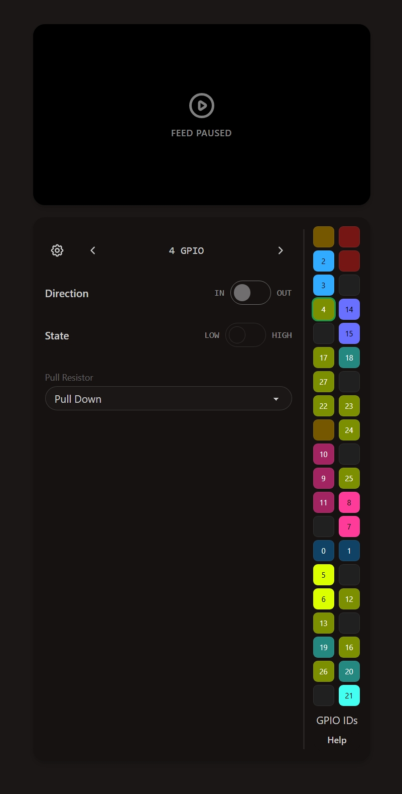

<table>
  <tr>
    <td valign="top">

<h1>📌 Pinned</h1>

<p><code>Pinned</code> is a GPIO pin control and webcam streaming interface for Raspberry Pi 4/5.</p>

<p>No auth or built in security, just a simple server you run on your Pi, then access from a browser on the same <strong>local network</strong>.</p>

<h2>Features</h2>
<ul>
  <li><strong>Instant GPIO Control:</strong> View and toggle GPIO directions (Input/Output), pull resistors, and logic states directly from the web interface.</li>
  <li><strong>MJPEG Camera Streaming:</strong> Plug in a USB webcam or any camera exposed at <code>/dev/video0</code> and it natively streams into the dashboard. That includes Pi Camera setups too, as long as they show up there.</li>
  <li><strong>Multiplayer &amp; Scriptable:</strong> Programmatically control pins from Python, Node, or any other language via the <a href="#websocket-api">WebSocket API</a>. It keeps the hardware, your scripts, and all web dashboards synchronized in real-time!</li>
</ul>

    </td>
    <td valign="top" align="right">
      
    </td>
  </tr>
</table>

<h2>Quick Start</h2>

**Prerequisites**
- Raspberry Pi / any arm64 or x86_64 machine (for testing)
- Linux (any systemd based, Trixie is tested)
- A USB webcam or Pi Camera (optional)

**Permissions**  
Add your user to the `video` and `gpio` groups for hardware access:
```sh
sudo usermod -a -G video,gpio $USER
```
> *Log out and back in (or just restart) for permissions to take effect!*

**Install**
```sh
curl -fsSL https://cd.pinned.shdata.net/install.sh | sh
```
Then open `http://<Pi Local IP>:7727` in your browser.

**Uninstall**
```sh
pinned uninstall
```

<h2>External Camera URL</h2>

Using a webcam plugged into the Pi is convenient, but she _chews_ through data. Unfortunately most webcams don't emit H.264 and a Pi **cannot** recode in real-time lmao. So as a backup for cases where you need to reduce bandwidth, you can point Pinned at an external camera page/stream from another machine on your network with magic H.264 powers.

Pinned itself is not doing WebRTC here, it just embeds whatever URL you paste into **External Camera URL**. **OBS + MediaMTX** is a simple, flexible, low latency option. Here's a crash course:

1. Download and run [MediaMTX](https://github.com/bluenviron/mediamtx) on your main PC (it's a tiny, single-file server).
2. For resolution, bitrate, and fps, a sweet spot is 1280x720, 2000kbps, and 30fps (this might come after the next step for you).
3. Go to **OBS** -> Settings -> Stream. 
   - **Service:** Custom
   - **Server:** `rtmp://localhost:1935/live`
   - **Stream Key:** `webcam`
4. Open **OBS** -> Settings -> Output. Change Output Mode to *Advanced*. Find your Video Encoder settings and make sure Profile is `baseline` and x264 options has `bframes=0`. WebRTC requires `0` B-frames for real-time streaming.
5. Click **Start Streaming** in OBS.
6. Open your **Pinned dashboard** settings, and paste the MediaMTX page it just built for you into the External Camera URL: `http://<YOUR_PC_LOCAL_IP>:8889/live/webcam`

<h2>WebSocket API</h2>

To read or control the GPIO pins programmatically, connect your favorite client (Python, Node.js, Rust, etc.) to the WebSocket hub at `ws://<Pi Local IP>:7727/api/pins/ws`.

When you connect, you will immediately receive a complete `sync` snapshot of the board's state. It contains an entry for every usable GPIO pin:

```json
{
  "type": "sync",
  "pins": {
    "3": { ... },
    "5": { ... },
    "7": {
      "settings": {
        "direction": "input",
        "state": "low",
        "pull": "none"
      },
      "valueHigh": false
    },
    "...": { ... }
  }
}
```

> **Note:** The ID keys used here (e.g. `"7"`) represent the **physical header pin block** (1-40), not the internal BCM GPIO number. Pinned currently supports controlling the 26 general purpose pins out of the 40-pin header.

To mutate a pin, send a `pin_update` payload. The `patch` object is optional-chaining (you only need to include the fields you intend to change):

```json
{
  "type": "pin_update",
  "pin": 7,
  "patch": {
    "direction": "output",
    "state": "high"
  }
}
```

Any patch sent to the hub instantly updates the physical hardware, and the new pin state is immediately broadcast to all connected clients (for instance, if you switch a pin to `"input"`, every dashboard and script receives an update reflecting that change). Those use the same format as the `pin_update` message.

Additionally, if a pin is configured as an input and you push a physical button plugged into the Pi, the hub automatically catches the hardware edge-event in real-time and broadcasts the new state (e.g. `"valueHigh": true`) to all connections using the same `pin_update` format.

> **Hardware Constraints:** 
> Physical header pins 3 and 5 (BCM GPIO 2 and 3) have hardwired 1.8k pull-up resistors on the Raspberry Pi PCB for I2C. Any `pin_update` patch attempting to set them to `pull: "down"` or `pull: "none"` will be safely ignored by the backend hub.
